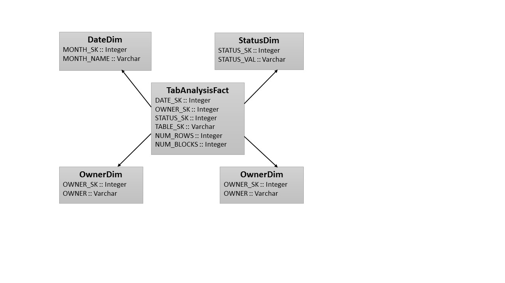

## An ETL Example: Create a simple Star-Schema over CSV files
In this example we will show how we can create a simple Star-Schema from a CSV file, which plays the role of our data source
### Data Source Description
In our example we will use as a data source a single CSV file, which stores the tables in a imaginary database. Here is a small extract (first 10 rows) of the contents of the file:

        $ head test-data.csv
    OWNER,TABLE_NAME,TABLESPACE_NAME,STATUS,NUM_ROWS,BLOCKS,LAST_ANALYZED
    APEX_030200,SYS_IOT_OVER_71833,SYSAUX,VALID,0,0,06/08/2012 16:22:36
    APEX_030200,WWV_COLUMN_EXCEPTIONS,SYSAUX,VALID,3,3,06/08/2012 16:22:33
    APEX_030200,WWV_FLOWS,SYSAUX,VALID,10,3,06/08/2012 22:01:21
    APEX_030200,WWV_FLOWS_RESERVED,SYSAUX,VALID,0,0,06/08/2012 16:22:33
    APEX_030200,WWV_FLOW_ACTIVITY_LOG1$,SYSAUX,VALID,1,29,07/20/2012 19:07:57
    APEX_030200,WWV_FLOW_ACTIVITY_LOG2$,SYSAUX,VALID,14,29,07/20/2012 19:07:57
    APEX_030200,WWV_FLOW_ACTIVITY_LOG_NUMBER$,SYSAUX,VALID,1,3,07/20/2012 19:08:00
    APEX_030200,WWV_FLOW_ALTERNATE_CONFIG,SYSAUX,VALID,0,0,06/08/2012 16:22:33
    APEX_030200,WWV_FLOW_ALT_CONFIG_DETAIL,SYSAUX,VALID,0,0,06/08/2012 16:22:33

Lets see a more readable representation by exploiting the `RTable.Core.printfRTable`function for formatted printing of an RTable of the DBFunctor package.  

    $ stack exec -- dbfunctor-example
    
    This is the source table:
    
    ---------------------------------------------------------------------------------------------------------------------------------
    OWNER           TABLE_NAME                        TABLESPACE_NAME     STATUS     NUM_ROWS     BLOCKS     LAST_ANALYZED
    ~~~~~           ~~~~~~~~~~                        ~~~~~~~~~~~~~~~     ~~~~~~     ~~~~~~~~     ~~~~~~     ~~~~~~~~~~~~~
    APEX_030200     SYS_IOT_OVER_71833                SYSAUX              VALID      0            0          06/08/2012 16:22:36
    APEX_030200     WWV_COLUMN_EXCEPTIONS             SYSAUX              VALID      3            3          06/08/2012 16:22:33
    APEX_030200     WWV_FLOWS                         SYSAUX              VALID      10           3          06/08/2012 22:01:21
    APEX_030200     WWV_FLOWS_RESERVED                SYSAUX              VALID      0            0          06/08/2012 16:22:33
    APEX_030200     WWV_FLOW_ACTIVITY_LOG1$           SYSAUX              VALID      1            29         07/20/2012 19:07:57
    APEX_030200     WWV_FLOW_ACTIVITY_LOG2$           SYSAUX              VALID      14           29         07/20/2012 19:07:57
    APEX_030200     WWV_FLOW_ACTIVITY_LOG_NUMBER$     SYSAUX              VALID      1            3          07/20/2012 19:08:00
    APEX_030200     WWV_FLOW_ALTERNATE_CONFIG         SYSAUX              VALID      0            0          06/08/2012 16:22:33
    APEX_030200     WWV_FLOW_ALT_CONFIG_DETAIL        SYSAUX              VALID      0            0          06/08/2012 16:22:33
    APEX_030200     WWV_FLOW_ALT_CONFIG_PICK          SYSAUX              VALID      37           3          06/08/2012 16:22:33
    
    
    10 rows returned
    ---------------------------------------------------------------------------------------------------------------------------------
The table contains ~3000 rows. The source table stores metadata about all the tables in an fictitious Oracle database. Each row represents a unique table. the column semantics are as follows:

 - OWNER = Owner of the table
 - TABLE_NAME = Name of the table
 - TABLESPACE_NAME = Name of the tablespace where this table is stored
 - STATUS = Status of the table (VALID/INVALID)
 - NUM_ROWS =  Number of rows in the table
 - BLOCKS = Number of Blocks allocated for this table
 - LAST_ANALYZED = Timestamp of the last time the table was analyzed (i.e., gathered statistics) 

### Target Data Model (Star Schema) Description
For the purposes of this example, lets assume that we want to build a very simple *Star Schema* (a typical data modelling approach for Data Warehouses and Data Marts) from the source file describe before. The star schema will consist of the central tables called *the Fact Table* and three surrounding *Dimension tables*.

### ETL (i.e., Data Transformation) Description
### Code

> Written with [StackEdit](https://stackedit.io/).

