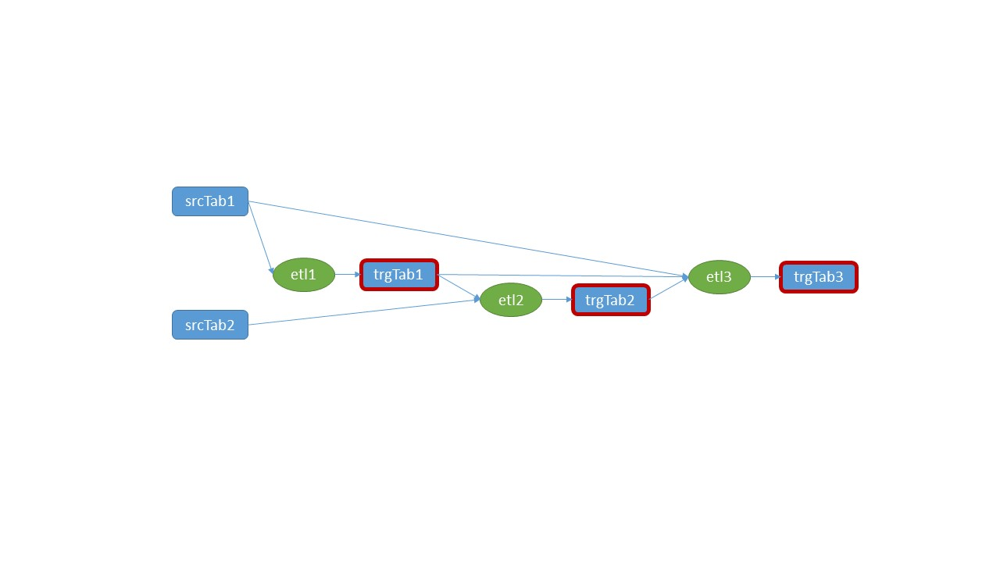
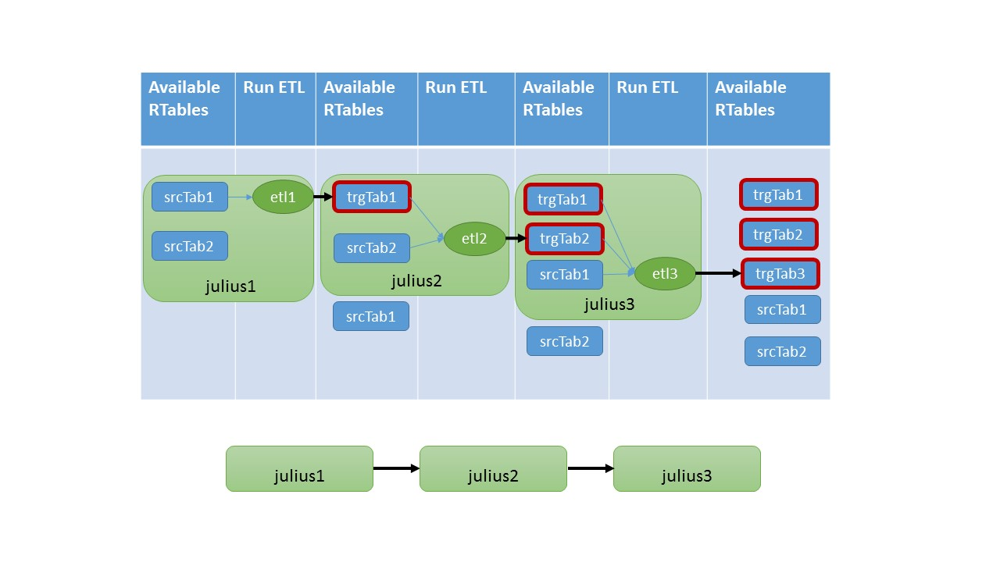


# Julius : An  Embedded Domain Specific Language for ETL data processing in Haskell
# A Tutorial
## Table Of Contents
 1. [Introduction](#introduction)
 2.  [Julius Basic Syntax: The Julius Expression. ](#syntax)
 3. [Julius DDL: Creating an RTable from a CSV file](#ddl)
 4. [Working with Relational Algebra Operations](#ralgebra)
	 1. [Relational Algebra Expressions](#rae)
	 2. [Relational Algebra Operations](##rao)
		 1. [Selection](#selection)
		 2. [Projection](#projection)
		 3. [Inner Join](#ij)
		 4. [Outer Join](#oj)
		 5. [Aggregation](#aggregation)
		 6. [Grouping](#grouping)
		 7. [Aggregation & Grouping on a Derived Column](#agdc)
		 8. [Set Operations](#so)
 5. [Beyond Relational Algebra](#bra)
	 1. [Ordering](#ordering)
	 2. [Generic RTable Operations as Functions](#roaf)
 6. [ETL in Haskell and Julius EDSL](#eih)
	 1.  [Column Transformations: The Column Mapping Clause](#colmap)
	 2. [Julius Expressions and the Ubiquitous ETL Mapping ](#etlm)
	 3. [Evaluating a Julius Expression](#evaljul)
	 4. [Writing ETL Code in Haskell and Julius EDSL](#etlcode)
 7. [Complex Queries as Julius Expressions](#cqaje)
	 1. [Subqueries](#subqueries)
	 2. [Naming Intermediate Results](#intresults)
 8. [Output](#output)
	 9. [Printing Results](#print)
	 10. [Output Result to CSV file](#output) 

<a name="introduction"></a>
## Introduction  
__Julius__ is an *Embedded Domain Specific Language (EDSL)* for ETL data processing in Haskell.  Julius enables us to express complex data transformation flows (i.e., an arbitrary combination of ETL operations) in a more friendly manner (a __Julius Expression__), with plain Haskell code (no special language for ETL scripting required).
It is an "embedded" DSL because it "lives" within Haskell code and is compiled with GHC as usual. It is not a different language requiring some special compiler/interpreter to work. 
In fact, a *Julius Expression* is just a common Haskell data type. The whole syntax of the Julius language consists of nothing more than a series of Haskell data type definitions. These data types simply comprise the Julius language. A syntax error in the Julius language is just a data type construction error that can be caught by the compiler.
In this tutorial, we will show the basics of Julius in order to help someone to get started. (See also the documentation of the **Etl.Julius** and **RTable.Core** **modules** of the **DBFunctor package** for more details on the data types and functions exposed). 
<a  name="syntax"></a> 
## Julius Basic Syntax: The Julius Expression  
A *Julius Expression* is a sequence of individual *ETL Operations* connected with the `:->` constructor. Each such operation acts on one (Unary), or two (Binary) input `RTable`(s) and produces a new (immutable) `RTable`. 
So, *a Julius Expression is a means to define an arbitrary complex data transformation over RTables, consisting of an arbitrary number of processing steps (aka ETL Operations) . *
In its most basic form a Julius expression looks like this:

    EtlMapStart :-> <etl operation> :-> ... <etl operation>

The `:->` connector is left associative because a Julius expression is evaluated from left to right (or from top to bottom). Essentially `:->` is a data constructor of the `ETLMappingExpr` data type , which receives two input parameters (check out the documentation of the Etl.Julius module in the DBFunctor package in Hackage - just google "Hackage Etl.Julius").
An "etl operation" can be either a *Relational Algebra Expression*, or a *Column Mapping* (i.e,. a column-level transformation). A Relational Algebra is a sequence of relational algebra operations acting on some input RTable(s). A Column Mapping is a transformation a the column-level where one or more new columns are created based on ore or more existing ones.We explain both concepts in the following paragraphs. 
A Relational Algebra expression in Julius EDSL begins with an `EtlR $` notation (after "$" follow the relational algebra operations), while a column mapping begins with `EtlC $`. So, a Julius expression essentially looks like this:
```
EtlMapStart :-> (EtlX $ ...) :-> (EtlX $ ...) :-> ... (EtlX $ ...)
```
where 'X' in "EtlX" is  'C' ,or 'R'.
We will comeback to Julius expressions in more detail, but first lets see how can we create an RTable.
<a  name="ddl"></a> 
## Julius DDL: Creating an RTable from a CSV file
In order to create an RTable from your data (i.e., load your data into memory into the RTable data structure), you only need to call function `toRTable`:

    toRTable :: (RTabular a) => RTableMData -> a -> RTable

`toRTable` is a method of the `RTabluar` type class, which resides in the RTable.Core module of the DBFunctor package. So, if your data are loaded in a data type `a` , which is an instance of the `RTabular` type class, then the only thing you have to do, is to call `toRTable`, in order to get a new RTable loaded with your data. Of course `toRTable` also requires as input the necessary RTable metadata (`RTableMData`), which define the RTable's columns and corresponding data types (similar to an SQL `CREATE TABLE`DDL statement).

For example, assume we have a csv file "mydata.csv" with a data set that we want to convert into an RTable, in order to be able to process it with some Julius expression.
The first step is to read the csv file into some data type `a` that is an instance of the `RTabular` type class. In module, RTable.Data.CSV of the DBfunctor package, we have defined data type `CSV` to represent a CSV file and have made it an instance of `RTabular`. So the only thing you have to do is:
1. Read the csv file from disk into the CSV data type
2. Define the RTable metadata (i.e., its columns and corresponding data types) using function `createRTableMData` exported from the Etl.Julius module of the DBFunctor package.
```
createRTableMData :: 
	(RTableName, [(ColumnName, ColumnDType)])	 
	-> [ColumnName]		--	Primary Key. [] if no PK exists
	-> [[ColumnName]]	--  list of unique keys. [] if no unique keys exists
	-> RTableMData
```
3. Use `toRTable` to convert the CSV into an RTable
These steps are depicted in the following code snippet.
```
import     Etl.Julius
import     RTable.Data.CSV     (CSV, readCSV, writeCSV, toRTable)

main:: IO()
main = do
	-- 1. Read the csv file
	mycsv <- readCSV "mydata.csv"

	-- 3. Transform CSV data type into an RTable data type
	let myRTable = toRTable rtabMdata mycsv

	-- 4. Do stuff with your new RTable
	...
	where
		-- 2. Define the structure of the RTable
		rtabMData :: RTableMData
		rtabMData = createRTableMData (
			"myTab"  -- table name
			,[	("OWNER", Varchar)				-- Owner of the table
				,("TABLE_NAME", Varchar)		-- Name of the table
				,("TABLESPACE_NAME", Varchar)	-- Tablespace name
				,("STATUS",Varchar)				-- Status of the table object (VALID/IVALID)
				,("NUM_ROWS", Integer)			-- Number of rows in the table
				,("BLOCKS", Integer)			-- Number of Blocks allocated for this table
				,("LAST_ANALYZED", Timestamp "MM_DD_YYYY HH24:MI:SS")	-- Timestamp of the last time the table was analyzed (i.e., gathered statistics)
			]
		)
			["OWNER", "TABLE_NAME"] -- primary key
			[]	-- (alternative) unique keys	
```
<a name="ralgebra"></a>
## Working with Relational Algebra Operations
Relational Algebra is the algebra behind SQL. Any SQL statement is transformed behind the scenes into an algebraic expression consisting of one or more relational algebra operations that define how we want to process our data. Typical examples of such operations are: Selection (i.e., row filter), Projection, Inner-Join, Outer-Join, Aggregation, Grouping, Ordering, Union, Intersection, Difference etc. Relational algebra operations are applied to sets of tuples (aka relations). 
Julius EDSL supports all common relational algebra operations and applies them onto RTables, which are sets of RTuples. With Julius one can express an arbitrary complex data-processing-operation /query, combining an arbitrary number of relational operations. The means to achieve this is the *Relational Algebra Expression Clause* in a Julius expression, that as we discussed before, it always begins with an:`EtlR $`clause.
Lets see the syntax of a Relational Algebra Expression.
<a  name="rae"></a> 
### Relational Algebra Expressions
A relational algebra expression in Julius EDSL is a sequence of relational operation clauses connected with the `:.` connector.  The first operation is always `ROpStart`, which represents an "empty" operation and is there to signify the beginning of the expression. Of course as we have said before the expression must follow an `EtlR $` clause. Here is the typical structure of a relational algebra expression in Julius:
```
EtlMapStart
        :-> (EtlR $
                ROpStart  
                :. (<relational operation 1>)
				:. (<relational operation 2>)
		
						...
		
				:. (<relational operation N>)
			)

```
Similar to the `:->` connector , `:.`  is left-associative (i.e., evaluated from left to right, or from top to bottom) with a higher precedence (infixl 6) than `:->` which is infixl 5.
<a  name="rao"></a> 
### Relational Algebra Operations
In this section we discuss the syntax of each relational algebra operation.
<a  name="selection"></a> 
#### SELECTION
**Meaning**: Filter RTuples of an RTable based on some RTuple-level predicate of type: 
```
type  RPredicate = RTuple -> Bool
```
**Input**: 
- RTable to apply the filter, 
- Predicate function

**Output**: A new (filtered) RTable

Syntax:
```
<Selection Operation> ::=
					Filter <FromRTable> <ByPred>

<FromRTable>	::=	From <TabExpr>
<TabExpr>		::= Tab <RTable> | Previous 	(* Specify the input RTable, or "Previous" if this operation is to be applied to a previous result, generated by the previous operation within the same expression *)
<RTable>		::= RTable

<ByPred>		::= FilterBy <RPredicate>
<RPredicate>	::= RTuple -> Bool		(* An RPredicate is simply a function of type RTuple -> Bool *)
```
Example:
```
juliusToRTable $           
    EtlMapStart
    :-> (EtlR $
            ROpStart  
            :. (Filter (From $ Tab expenses) $ FilterBy myFpred))

myFpred :: RPredicate
myFpred = \t -> t <!> "category" == "FOOD:SUPER_MARKET" 
                && 
                t <!> "amount" > 50.00
```
SQL equivalent:
```
SELECT * 
FROM expenses exp 
WHERE   exp.category = 'FOOD:SUPER_MARKET' 
        AND exp.amount > 50.00
```
Notes:
1. In order to access the value stored in a specific column in an RTuple, we can use the `<!>` function or the `<!!>` function. The former returns the value, while the latter returns the value wrapped within a Maybe, in the case that the column is not found. (Check out the documentation of the RTable.Core module of the DBFunctor package). Here are the corresponding signatures:
```
(<!>)	:: RTuple -> ColumnName -> RDataType	
(<!!>)	:: RTuple -> ColumnName -> Maybe RDataType	

```
2. Function `juliusToRTable` evaluates a Julius expression and returns an RTable. We will discuss Julius expression evaluation later on.
<a  name="projection"></a> 
#### PROJECTION (SELECT)
**Meaning**: Column projection (i.e., select only the columns of interest)
**Input**: 
- Column names to be selected
- Input RTable to apply this operation
**Output**: A new (projected) RTable

Syntax:
```
<Projection Operation> ::=
					Select [<ColumnName>] <FromRTable>  (* This is a list of column names *)
					
<ColumnName>	::= Text

<FromRTable>	::=	From <TabExpr>
<TabExpr>		::= Tab <RTable> | Previous 	(* Specify the input RTable, or "Previous" if this operation is to be applied to a previous result, generated by the previous operation within the same expression *)
<RTable> 		::= RTable
```
Example:
```
juliusToRTable $           
    EtlMapStart
    :-> (EtlR $
            ROpStart  
            :. (Filter (From $ Tab expenses) $ FilterBy myFpred)
            :. (Select ["TxTimeStamp", "Category","Description", "Amount"] $ From Previous))
```
SQL equivalent:
```
SELECT "TxTimeStamp", "Category", "Description", "Amount" 
FROM expenses exp 
WHERE   exp.category = 'FOOD:SUPER_MARKET' 
        AND exp.amount > 50.00
```
Notes:
In the above example, we have applied a Projection operation (Select clause), right after a filtering operation (Filter clause). Note that in the SQL equivalent, the "*" in the SELECT clause from the previous example, has been replaced with a reference to specific columns.
<a  name="ij"></a> 
#### INNER JOIN
**Meaning**: An inner join operation between two RTables tries to pair the RTuples based on some join predicate of the type: 
```
type  RJoinPredicate = RTuple -> RTuple -> Bool
```
So this more generic than an "equi-Join", which is when then predicate involves only equality conditions between the columns of the two input RTables. In fact, it the equivalent to what is called a "theta-Join" in relational algebra. I.e., a Join operation where the "pairing condition" can be anything. Indeed, the join predicate is an arbitrary function between two RTuples of the input RTables that returns True, only when the input RTuples must be paired. 
**Input**: 
- Two Input RTables to be joined
- Join Predicate function

**Output**: A new (joined) RTable


Syntax:
```
<Inner Join Operation> ::=
						Join <TabLiteral> <TabExpr> <TabExprJoin>

<TabLiteral>		::= TabL <RTable>
<RTable>			::= RTable

<TabExpr>			::= Tab <RTable> | Previous 	(* Specify the input RTable, or "Previous" if this operation is to be applied to a previous result, generated by the previous operation within the same expression *)

<TabExprJoin>		::= JoinOn <RJoinPredicate>
<RJoinPredicate>	::= RTuple -> RTuple -> Bool
```
Example:
```
juliusToRTable $           
    EtlMapStart
    :-> (EtlR $
            ROpStart  
            :. (Join (TabL expenses) (Tab categories) $ 
		            JoinOn (\tl tr -> tl <!> "category" == tr <!> "category")))
```
SQL equivalent:
```
SELECT * 
FROM expenses exp JOIN categories cat 
		ON exp.category = cat.category
```
Notes:
- In the above example, we show a simple (equi) join between two RTables (namely expenses and categories).  The join condition is defined as a lambda expression. 
**Common Columns Naming Convention**
- In this example, we have not projected any columns, so all columns from both RTables are returned. Please note that for common column names between the two input RTables in the result of the join, we follow the convention: 
When we have two tuples t1 and t2 with a common column name (lets say "Common"), then the resulting tuple after a join will be "Common", "Common_1", so a "_1" suffix is appended. The tuple from the left table by convention retains the original column name. So "Column_1" is the column from the right table. If "Column_1" already exists, then "Column_2" is used.
<a  name="oj"></a> 
#### OUTER JOIN
**Meaning**:  Similar in concept with the Inner Join operation in that the goal is to "pair" the RTuples coming from the two input RTables. However, in the Outer Join operation, one of the two operand RTables is the "Preserving RTable". This means that all RTuples coming from the preserving RTable, will be preserved in the result. So the result will have the same number of RTuples as the preserving RTable. 

The result RTuple will have the columns from both RTables. The columns of the non-preserving RTable will have a value for those RTuples that have managed to be paired (i.e., satisfy the join condition) and a `Null` value for those that haven't.

When the preserving RTable is the left operand of the outer join, then we have a *Left Outer Join* operation. If it is the right operand, then we have a *Right Outer Join*. If both RTable operands are preserving, then we have a *Full Outer Join*.

Common columns appear in the result with the same naming convention as in the inner join operation (see above). However, in a Left Outer Join (and a Full Outer Join), the left RTable columns will retain their original name when there is a column name conflict, while in a Right Outer Join, it is the right RTable columns that will retain their original name.
**Input**: 
- Two Input RTables to be (outer) joined
- Join Predicate function

**Output**: A new (outer-joined) RTable


Syntax:
```
<Outer Join Operation> ::=
						LJoin <TabLiteral> <TabExpr> <TabExprJoin>
						|
						RJoin <TabLiteral> <TabExpr> <TabExprJoin>
						|
						FOJoin <TabLiteral> <TabExpr> <TabExprJoin>

<TabLiteral>		::= TabL <RTable>

<TabExpr>			::= Tab <RTable> | Previous 	(* Specify the input RTable, or "Previous" if this operation is to be applied to a previous result, generated by the previous operation within the same expression *)
<RTable>			::= RTable

<TabExprJoin>		::= JoinOn <RJoinPredicate>
<RJoinPredicate>	::= RTuple -> RTuple -> Bool
```
Example:
```
juliusToRTable $           
    EtlMapStart
    :-> (EtlR $
            ROpStart  
            :. (LJoin (TabL expenses) (Tab categories) $ 
		            JoinOn (\tl tr -> tl <!> "category_id" == tr <!> "category_id")))

juliusToRTable $           
    EtlMapStart
    :-> (EtlR $
            ROpStart  
            :. (RJoin (TabL categories) (Tab expenses) $ 
		            JoinOn (\tl tr -> tl <!> "category_id" == tr <!> "category_id")))

```
SQL equivalent:
```
SELECT * 
FROM expenses exp LEFT JOIN categories cat 
		ON exp.category_id = cat.category_id

SELECT * 
FROM categories exp RIGHT JOIN expenses cat 
		ON exp.category_id = cat.category_id

```
Notes:
- The above two queries are equivalent (i.e., return the same results) and just differ in the type of the outer join. In both queries the preserving RTable is the expenses. The query outer joins the expenses RTable with the categories RTable in an effort to get the category of an expense. However, since expenses is the preserving RTable, if an expense RTuple does not include a category, it will be preserved in the result.
<a  name="aggregation"></a> 
#### AGGREGATION
**Meaning**:  The Aggregate operation is used when we want to apply an aggregate function (e.g., sum, average, min, max ,etc.) over the values of one or more columns of an RTable. It is important to understand that when we apply an aggregate operation to an RTable, then the resulting RTable is a single-RTuple RTable. The resulting RTuple includes only the aggregate-result columns and nothing more. 
**Input**: 
- A list of input columns to be aggregated and the aggregate function to be applied to each one, as well as the names of the new (aggregated) columns
- The input RTable over which the aggregation will be applied

**Output**: 
- A new (aggregated) RTable

Syntax:
```
<Aggregation Operation> ::=
						Agg <Aggregate>

<Aggregate>			::= AggOn [<AggOp>] <FromRTable>
<AggOp>				::=		Sum <ColumnName> <AsColumn>
						|	Count <ColumnName> <AsColumn>
						|	Min <ColumnName> <AsColumn>
						|	Max <ColumnName> <AsColumn>
						|	Avg <ColumnName> <AsColumn>
						
<AsColumn>			::= As <ColumnName>						
<ColumnName>		::= Text
<FromRTable>		::=	From <TabExpr>
<TabExpr>			::= Tab <RTable> | Previous 	(* Specify the input RTable, or "Previous" if this operation is to be applied to a previous result, generated by the previous operation within the same expression *)
<TabExpr>			::= Tab <RTable> | Previous 	(* Specify the input RTable, or "Previous" if this operation is to be applied to a previous result, generated by the previous operation within the same expression *)
<RTable>			::= RTable
```
Example:
```
juliusToRTable $           
    EtlMapStart
    :->	(EtlR $
            ROpStart  
            :. (Agg $ 
			       AggOn [Sum "Amount" $ As "TotalAmount", Count "Tx_id" $ As "TxCount"] $ 
				       From $ Tab expenses
		       )
		)       
```
SQL equivalent:
```
SELECT sum("Amount") as "TotalAmount", count("Tx_id") as "TxCount" 
FROM expenses 
```
Notes:
- In the query above we apply the two aggregate functions (sum and count) over the "Amount" and transaction_id ("Tx_id") columns respectively of the expenses RTable. The resulting RTable is a single-RTuple RTable with two columns, namely "TotalAmount" and "TxCount".
<a  name="grouping"></a> 
#### GROUPING (GROUP BY)
**Meaning**:  The Grouping operation groups together RTuples based on a grouping predicate and than applies an aggregation operation (the same one) on each group separately. The aggregation operation, as we have seen from the previous paragraph, can include on or more aggregations on the input columns. The grouping predicate is an arbitrary function between two RTuples of the input RTables that returns True, only when the input RTuples should belong in the same group. The result is the set of aggregated RTuples (one RTuple corresponding to each group) consisting of the grouping columns as well as the aggregate-result columns.
**Input**: 
- The grouping columns from the input RTable
- The aggregation operation(s) to be applied
- The grouping predicate 
- The input RTable over which the grouping will be applied

**Output**: 
- A new (grouped) RTable

Syntax:
```
<Grouping Operation> ::=
				GroupBy [<ColumnName>] <Aggregate> <GroupOnPred>

<ColumnName>		::= Text

<Aggregate>			::= AggOn [<AggOp>] <FromRTable>
<AggOp>				::=		Sum <ColumnName> <AsColumn>
						|	Count <ColumnName> <AsColumn>
						|	Min <ColumnName> <AsColumn>
						|	Max <ColumnName> <AsColumn>
						|	Avg <ColumnName> <AsColumn>
						
<AsColumn>			::= As <ColumnName>						
<FromRTable>		::=	From <TabExpr>
<TabExpr>			::= Tab <RTable> | Previous 	(* Specify the input RTable, or "Previous" if this operation is to be applied to a previous result, generated by the previous operation within the same expression *)
<RTable>			::= RTable

<GroupOnPred>		::= GroupOn <RGroupPredicate>
<RGroupPredicate>	::= RTuple -> RTuple -> Bool

```
Example:
```
juliusToRTable $           
    EtlMapStart
    :-> (EtlR $
            ROpStart  
            :. (GroupBy ["Category"]  
                        (AggOn [Sum "Amount" $ As "TotalAmount"] (From $ Tab expenses)) $ 
                        GroupOn  (t1 t2 -> t1 <!> "Category" == t2 <!> "Category") 
                )
		)      
```
SQL equivalent:
```
SELECT "Category",  sum("Amount") AS "TotalAmount"
FROM expenses exp 
GROUP BY  "Category" 
```
Notes:
- In the query above we group the expenses RTable on the "Category" column. The grouping predicate between two RTuples t1 and t2 is an equality condition on the "Category" column value. Additionally we have a single aggregation operation, namely a sum over the "Amount" column. The resulting RTable has an RTuple of two columns for each category: the category name and the summed expenses amount for this category.
<a  name="agdc"></a> 
#### Aggregation & Grouping on a Derived Column
There are cases where we need to apply an aggregation or a grouping operation on a column-level expression. For example, we might want to sum the product of two columns, or we have a date column and we want to group by month (i.e., a truncated date at the month level), etc. 

Julius EDSL supports all these cases, but since column-level expression is essentially a *derived column*, we need to precede the aggregation or grouping operation in our Julius expression, with  a *Column Mapping* clause, in order to create the derived column on which the aggregation or grouping will be applied.
We will discuss Column Mapping next, after the Relational Algebra operations and there we can see a such an example. 
<a  name="so"></a> 
#### Set Operations
**Meaning**:  RTables conceptually are (or should be*) sets of RTuples. Therefore, it is only natural to support set operations over RTables such as Union, Intersection and Difference of sets. By definition a set does not include duplicates. Therefore, when we Union two RTables, the RTuples of the left RTable, are removed from the right RTable in the result, but if the left (or right) RTable contains duplicate RTuples, so will the result.

(*) It is known that the implementation of Relational Tables in commercial RDBMSs diverges from the theoretic definition of the relation, being a set of tuples. For example, a relational table might include duplicate rows, which is something not allowed in a set. Also, a relational table can be ordered, while in a set there is no notion of ordering between the set elements. Our implementation of the `RTable` is similar to the Relational Table found in an RDBMS.
**Input**: 
- Two Input RTables to apply a set operation

**Output**: A new  RTable (the result of the set operation)

Syntax:
```
<Set Operation> ::=
						<TabLiteral> `Union` <TabExpr>
						|
						<TabLiteral> `Intersect` <TabExpr>	
						|
						<TabLiteral> `Minus` <TabExpr>
						|
						<TabLiteral> `MinusP` <TabExpr>

<TabLiteral>		::= TabL <RTable>

<TabExpr>			::= Tab <RTable> | Previous 	(* Specify the input RTable, or "Previous" if this operation is to be applied to a previous result, generated by the previous operation within the same expression *)
<RTable>			::= RTable
```
Example:
```
juliusToRTable $           
    EtlMapStart
    :-> (EtlR $
            ROpStart  
	            -- 1. A Filter operation on expenses
			:. (Filter (From $ Tab expenses) $ FilterBy getJulyExpenses)
							
				-- 2. A Union of the previous result with revenues RTable
            :. (Union (TabL revenues) $ Previous)
		)
```
SQL equivalent:
```
SELECT *
FROM expenses
WHERE
	<getJulyExpenses predicate>
UNION
SELECT *
from revenues
```
Notes:
- We show a simple Union operation between two RTables: expenses and revenues. We assume that both of these RTables have an identical RTuple structure (i.e., the same column names and data types). 
- The expenses RTable is first filtered by some "getJulyExpenses" `RPredicate`. The Union operation's right operand is the result of this filter operation, which is denoted by the `Previous` keyword.
<a  name="bra"></a> 
## Beyond Relational Algebra
Julius EDSL goes beyond the standard relational algebra operations. For example, in a set, we cannot define any ordering on its elements. So, in standard relational algebra there is no sorting operation defined. However, in real life, the ORDER BY clause is one of the most commonly used clauses in SQL, because we indeed need to sort the results of our queries. To this end, Julius supports "ORDER BY", as we will see next. Moreover, Julius supports the notion of a *generic unary/binary relational operation*, where one can provide an arbitrary function for implementing it. These will be the topics of the next paragraphs.
<a  name="ordering"></a> 
### ORDERING (ORDER BY)
**Meaning**:  The Julius Ordering clause is very similar to the SQL ORDER BY clause. You specify a list of columns based on which the input RTable will be sorted. The leftmost column in the list, takes the highest priority in the ordering and the rightmost the lowest. Each column can be separately ordered in ascending, or descending order. One difference with SQL ORDER BY is that we must explicitly specify the ordering type (ascending or descending), because there is no default.
**Input**: 
- A list of (column names, ordering specification - ascending/descending) pairs that defines the sorting of the input RTable
- The input RTable to be sorted

**Output**: A new (sorted) RTable (the result of ordering operation)
Syntax:
```
<Ordering Operation> ::=
		OrderBy [(<ColumnName>, <OrderingSpec>)] <FromRTable>

<ColumnName> 	::= Text

<OrderingSpec>	::= Asc | Desc

<FromRTable>	::=	From <TabExpr>
<TabExpr>		::= Tab <RTable> | Previous 	(* Specify the input RTable, or "Previous" if this operation is to be applied to a previous result, generated by the previous operation within the same expression *)
<RTable>		::= RTable

```
Example:
```
juliusToRTable $           
    EtlMapStart
    :-> (EtlR $
            ROpStart  	     
			:. (OrderBy [("Category", Asc),("TxDate",Desc)] $ 
					From $ Tab expenses)
		)
```
SQL equivalent:
```
SELECT *
FROM expenses
ORDER BY "Category", "TxDate" desc
```
Notes:
- In this example, we have sorted the expenses RTable based on the "Category" column in ascending order and then, by "TxDate" values in descending order.

<a  name="roaf"></a> 
### Generic RTable Operations as Functions
**Meaning**:  Functionally speaking, an RTable operation is nothing more than a function from an RTable to an RTable, i.e., of the type: `RTable -> RTable`. To be more precise, this defines a *unary* RTable operation. Similarly, if we are talking about a *binary* RTable operation (e.g., a Join), then this is nothing more than a function of two parameters of the type: 
`RTable -> RTable -> RTable`. 
In order, to accommodate in Julius EDSL the ability to define an arbitrary function over RTables, as an RTable operation to be evaluated within a Julius expression (together with the standard relational operations that we have already discussed), we have provided two special clauses, in order to define a *generic unary (or binary) RTable operation*.
**Input**: 
- The function (or lambda expression) that defines the RTable operation 
- The input RTable(s) 

**Output**: A new RTable (the result of the application of the function)
Syntax:
```
<Generic RTable Operation> ::=
							GenUnaryOp <OnRTable> <ByGenUnaryOperation>
							|
							GenBinaryOp <TabLiteral> <TabExpr> <ByGenBinaryOperation>

<OnRTable>				::=	On <TabExpr>
<TabExpr>				::= Tab <RTable> | Previous 	(* Specify the input RTable, or "Previous" if this operation is to be applied to a previous result, generated by the previous operation within the same expression *)
<RTable>				::= RTable

<ByGenUnaryOperation>	::= ByUnaryOp <UnaryRTableOperation>
<UnaryRTableOperation>	::= RTable -> RTable

<TabLiteral>			::= TabL <RTable>
<ByGenBinaryOperation>	::= ByBinaryOp <BinaryRTableOperation>
<BinaryRTableOperation>	::= RTable -> RTable -> RTable
```
Example: 
1. Add a surrogate key column and assign values to it.
2. Append a delta RTable to a target RTable
```
-- 1.
juliusToRTable $           
    EtlMapStart
    :-> (EtlR $
            ROpStart  	     
			:. (GenUnaryOp (On $ Tab expenses) $ 
						ByUnaryOp (addSurrogateKeyJ "TxSK" 0))
		)

-- 2.
juliusToRTable $           
    EtlMapStart
    :-> (EtlR $
            ROpStart  	     
			:. (GenBinaryOp (TabL rtabTarget) (Tab $ deltaTabFinal) $ 
					ByBinaryOp appendRTableJ)
		)
```
SQL equivalent:
```
-- 1.
CREATE TABLE expenses_new AS
	SELECT (rownum - 1) as "TxSK", t.*
	FROM expenses t

-- 2.
INSERT /*+ append */ INTO rtabTarget
	SELECT * FROM deltaTabFinal
```
Notes:
- In the first example, we use function `addSurrogateKeyJ` from the Etl.Julius module of the DBFunctor package, as a generic unary RTable operation. This function adds a new column (a surrogate key column) to the input RTable and then assigns values (a monotonically increasing integer value) starting off from an initial value (in our case the initial value is 0). Here is the signature of the  `addSurrogateKeyJ` function
```
addSurrogateKeyJ :: Integral a     
				=> ColumnName    	-- ^ The name of the surrogate key column
				-> a            -- ^ The initial value of the Surrogate Key
				-> RTable       -- ^ Input RTable
				-> RTable       -- ^ Output RTable
```
- In the second example, we use function `appendRTableJ` from the Etl.Julius module of the DBFunctor package, as a generic binary RTable operation. This function appends the RTuples of an RTable to a target RTable. In our example, we assume that we have an RTable containing a daily delta (deltaTabFinal) and we append it to a target RTable (rtabTarget). Here is the signature of the `appendRTableJ` function.
```
appendRTableJ ::
				RTable		-- ^ Target RTable
			->  RTable 		-- ^ Input RTable
			->  RTable 		-- ^ Output RTable
```
<a name="eih"></a>
## ETL in Haskell and Julius EDSL
<a name="colmap"></a>
### Column Transformations: The Column Mapping Clause
**Meaning**:  A Column Mapping is the main ETL/ELT construct for defining *a column-level transformation*. Essentially with a Column Mapping, we can create one or more new (aka derived) column(s) , based on an arbitrary transformation function that maps a set of input columns (_Source Columns_) to a set of output columns (_Target Columns_):
`type ColXForm = [RDataType] -> [RDataType]`
(Note: `RDataType` is the standard data type  of a column in an RTuple (essentially a sum type acting as a wrapper for all common column data types), as it is defined in module RTable.Core of package DBFunctor)
So, in general with a column mapping we can express any NxM column transformation, where
1 ≤ N ≤ #source-columns and M ≥ 1. 
**Input**: 
- A list of source columns
- A list of target columns
- The input RTable 
- The column-level transformation to take place
When we want to implement a NxM column mapping, we need to provide a column transformation function (or lambda expression) of type `ColXForm`, with an input list of N elements and an output list of M elements. Each element in the input list corresponds one-to-one, to the corresponding element in the source columns list. Similarly, each element in the output list, corresponds  one-to-one, to the corresponding element in target columns list.
- An indicator of whether the source columns will be retained or removed in the output RTable
- An optional RTuple-level predicate, in order to apply a filter in the output RTable

**Output**: A new RTable (the result of the column transformation). The output RTable will include the target columns with values based on the column transformation function. 
The source columns will be included only if the `DontRemoveSrc`keyword was specified in the column mapping. 
If a target-column has the same name with a source-column and a `DontRemoveSrc` has been specified, then the (target-column, target-value) key-value pair, *overwrites* the corresponding (source-column, source-value) key-value pair (we cant have the same column name in two columns in the same RTuple).

Syntax:
```
<Column Mapping> ::=
							Source [<ColumnName>] <ToColumn>

<ColumnName>			::= Text

<ToColumn>				::= Target [<ColumnName>] <ByFunction>

<ByFunction>			::= By <ColXForm> <OnRTable> <RemoveSrcCol> <ByPred>
<ColXForm>				::= [RDataType] -> [RDataType]
<OnRTable>				::=	On <TabExpr>
<TabExpr>				::= Tab <RTable> | Previous 	(* Specify the input RTable, or "Previous" if this operation is to be applied to a previous result, generated by the previous operation within the same expression *)
<RTable>				::= RTable
<RemoveSrcCol>			::= RemoveSrc | DontRemoveSrc	
<ByPred>				::= FilterBy <RPredicate>
<RPredicate>			::= RTuple -> Bool
```
Example 1: Create a timestamp and a date column (target columns) from a text column (source column)

In this example, we use a single source column ("Date"), which stores date values in a Text format (`RText` data constructor of the `RDataType` data type). We want to use this column and create two new (derived) columns, namely "TxTimeStamp" and "TxDate", that will convert the source date value into a timestamp (truncated at 00:00:00 time) and date data type respectively. 
To this end, we provide a column transformation function ("dateTransformation") that converts the text value into a timestamp and a date, using the `RTime` and `RDate` data constructors of the `RDataType` data type of the RTable.Core module of the DBFunctor package.
In addition, we specify (by the keyword `RemoveSrc`) that the source column should be removed from the result RTable and that the result RTable, will include all source RTuples (since the `FilterBy` clause includes a predicate that returns always True).
```
juliusToRTable $           
	EtlMapStart
	    :-> (EtlC $
	            Source ["Date"] $ 
	            Target ["TxTimeStamp", "TxDate"] $ 
	            By dateTransformation (On $ Tab mytab) RemoveSrc $
	            FilterBy (\_ -> True)
	        )
	    where
			dateTransformation = 
			    \[(RText dt)] -> let
			                            txtimestamp = RTime {rtime = createRTimeStamp  "DD/MM/YYYY HH24:MI:SS" (Data.Text.unpack (dt `Data.Text.append` " " `Data.Text.append` "00:00:00"))}
			                            txdate = RDate {rdate = dt, dtformat = "DD/MM/YYYY"}
			                     in [txtimestamp,txdate]
```
Example 2: Create a derived (target) column "Margin" from two source columns, namely "Revenue" and "Cost". In the result RTable, we keep both of the source columns (`DontRemoveSrc`) and we don't filter any RTuples.
```
juliusToRTable $           
	EtlMapStart
	    :-> (EtlC $
	            Source ["Revenue", "Cost"] $ 
	            Target ["Margin"] $ 
	            By (\[rev, cost] -> [rev - cost]) (On $ Tab totalstab) DontRemoveSrc $
	            FilterBy (\_ -> True)			    
			)
```
<a name="etlm"></a>
### Julius Expressions and the ubiquitous ETL Mapping 
A Julius Expression defines a sequence of data processing steps (aka "ETL logic"), applied to one or more *source RTables*, in order to produce a new RTable, called the *target RTable*, which is the outcome of all these processing steps. So if we would like to abstract the pattern that we follow in a Julius expression, then this is the following:
```
[Source RTables] -> <ETL logic> -> Target RTable
```
The "ETL logic" is embedded in the Julius expression. It is the logic by which, we transform the source RTable(s) into the target RTable. So, one can say that: 

*A Julius expression embeds the data transformation logic (aka ETL logic) that when applied to a set of Source RTables,  produces a new RTable, called the Target RTable* 

I don't know if this sounds familiar to you, but this is exactly the definition of the *ETL Mapping* (or *Data Mapping*) concept, which is a construct ubiquitous to all contemporary ETL tools. 

Essentially, an ETL mapping is the data mapping unit, by which we implement the logic for loading/creating a single (target) table from one or more source tables. This table does not need to be a "final" table in our data processing pipeline. It can very well be some intermediate staging table, where we need to temporarily store some results that we will use in a later data processing step. In real-life Data Warehouses, a typical ETL flow might include hundreds or thousands of individual ETL mappings.

*Therefore a Julius expression is "the Haskell equivalent" to an ETL mapping, or more mathematically stated, we can say that the set of Julius Expressions and the set of ETL mappings are isomorphic (i.e., there is a one-to-one correspondence between them)* and we can write: 
```
Julius Expression ≌ ETL Mapping
```
That is the reason that the Haskell data type of the Julius Expression is named `ETLMappingExpr`.
<a name="evaljul"></a>
### Evaluating a Julius Expression
From the previous section, we have seen in order to produce a target RTable, we need to apply some ETL logic to one or more source RTables:
```
[Source RTables] -> <ETL logic> -> Target RTable
```
Since the Julius expression embeds the ETL logic but also the source RTables, which appear in every relational operation or column mapping (as we have seen in the examples above), then we can write:
```
([Source RTables] -> <ETL logic>) -> Target RTable =
Julius Expression -> Target RTable
```
Indeed, each Julius expression corresponds to one and only one target RTable and thus there is a clear mapping of the form:
```
 Julius Expression -> RTable
```
Of course, many different Julius expressions might evaluate to the same target RTable, just as many different SQL statements might produce the same results.

In order to execute the ETL logic and produce the target RTable, we need to *evaluate* the Julius expression. More technically speaking, since the Haskell data type of a Julius expression is the `ETLMappingExpr`, then this evaluation function must be a function of the type: 
```
ETLMappingExpr -> RTable
```
Indeed, the basic Julius expression evaluation function, which is defined in the module Etl.Julius of the DBFunctor package is:
```
juliusToRTable :: ETLMappingExpr -> RTable
```
We have used this function in all of our examples above. Of course, due to Haskell's laziness the actual evaluation of the Julius expression, takes place only when it is absolutely necessary, e.g., when we try to print the contents of an RTable to screen, or store it into a CSV file.
<a name="etlcode"></a>
### Writing ETL Code in Haskell and Julius EDSL
We have seen that *behind each Julius expression lies a target RTable*. This is important to remember, because when we want to write our ETL code in Haskell and Julius EDSL, then we can follow this simple rule:

__*Simple Guiding Rule 1*__
_Each target RTable that must be created* based on some ETL logic, can be replaced with a_ `juliusToRTable <julius expresssion>` _expression_

---
(*)	We say "created" instead of "loaded", because since Haskell is immutable, the evaluation of a Julius expression, always results into a new RTable.

---
Lets see how beautiful ETL code we can write in Haskell. Lets assume the following ETL Source-to-Target Design:
|Data Sources		|ETL Design										|	Target Schema
|:---							|:---														|:---
|srcTab1, srcTab2	|[srcTab1] -> etl1								| -> trgTab1
| 								|[trgTab1, srcTab2] -> etl2					| -> trgTab2	
|								|[srcTab1, trgTab1, trgTab2] -> etl3	| -> trgTab3


At the right end, we see three target RTables (trgTab1, trgTab2, trgTab3). These should be the output  of our ETL code. In order to create each one of these, we need to run some "etl-logic code", etl1, etl2 and etl3 respectively. 
Each etl code might require as input one of the source RTables (srcTab1, srcTab2) and/or some of the target RTables (trgTab1, trgTab2, trgTab3). The exact dependencies for each etl code, appear in the middle column named "ETL Design".
In the following diagram, we depict the dependencies for each one of the three target RTables as a graph.


Fig 1. Dependencies for creating the target RTables (aka ETL Design).

Now, if we follow Rule 1 from above, we can substitute each target RTable with an equivalent Julius expression. So we can do this:
```
trgTab1 = juliusToRTable julius1
trgTab2 = juliusToRTable julius2
trgTab3 = juliusToRTable julius3
```  
where julius1, julius2 and julius3 are the equivalent Julius expressions behind each target RTable. Remember that: *each Julius expression is essentially (input RTables + ETL logic)*. The necessary input RTables for each Julius expression, are clearly stated in the middle column named "ETL Design", in the table above, but also can be seen in Fig 1.
The next step is to order the evaluation of the Julius expressions, in such a way, that the input RTable requirements of each one are met. This can be depicted in Fig. 2.


Fig 2. Evaluation order of Julius expressions according to input RTable requirements

In Fig 2, we can see that each target RTable is created by the evaluation of a specific Julius expression (denoted with a bold black arrow). At the bottom of the figure, we can see the evaluation order of the three Julius expressions. First we evaluate julius1, since its input requirements are just a source RTable and has no dependency to other Julius expression evaluation. Then, we proceed with julius2, which requires the result of the evaluation of julius1. Finally, we evaluate julius3, which requires both the evaluation of the other two.

Now  we can state our second guiding rule for writing ETL code in Haskell and Julius:

__*Simple Guiding Rule 2*__
_Order the evaluation of the Julius expressions based on their input RTable requirements._

Lets write our Haskell ETL function that implements the ETL design of our running example:
```
import Etl.Julius

etl :: RTable -> RTable -> [RTable]
etl srcTab1 srcTab2 = 
	let
-- 1. Substitute each target RTable with the corresponding Julius expression
-- 2. Order the evaluation of the Julius expressions based on their input RTable requirements
		trgTab1 = juliusToRTable $ julius1 srcTab1
		trgTab2 = juliusToRTable $ julius2 trgTab1 srcTab2
		trgTab3 = juliusToRTable $ julius3 trgTab1 trgTab2 srcTab1	
	in [trgTab1,trgTab2,trgTab3]
	where
		julius1 :: RTable -> ETLMappingExpr
		julius1 = undefined

		julius2 :: RTable -> RTable -> ETLMappingExpr
		julius2 = undefined

		julius3 :: RTable -> RTable -> RTable -> ETLMappingExpr
		julius3 = undefined
```
We can clearly see the substitution of each target RTable with the corresponding Julius expression, as well as the ordering of the evaluation of the Julius expressions based on their input RTable dependencies.
<a name="cqaje"></a>
## Complex Queries as Julius Expressions
<a name="subqueries"></a>
### Subqueries
example : running total
<a name="intresults"></a>
### Naming Intermediate Results
subquery factory (WITH clause)
<a name="output"></a>
## Output
<a name="print"></a>
### Printing Results
#### Default Formatted Printing
#### Formatted Printing
<a name="output"></a>
### Output Result to CSV file


> Written with [StackEdit](https://stackedit.io/).
